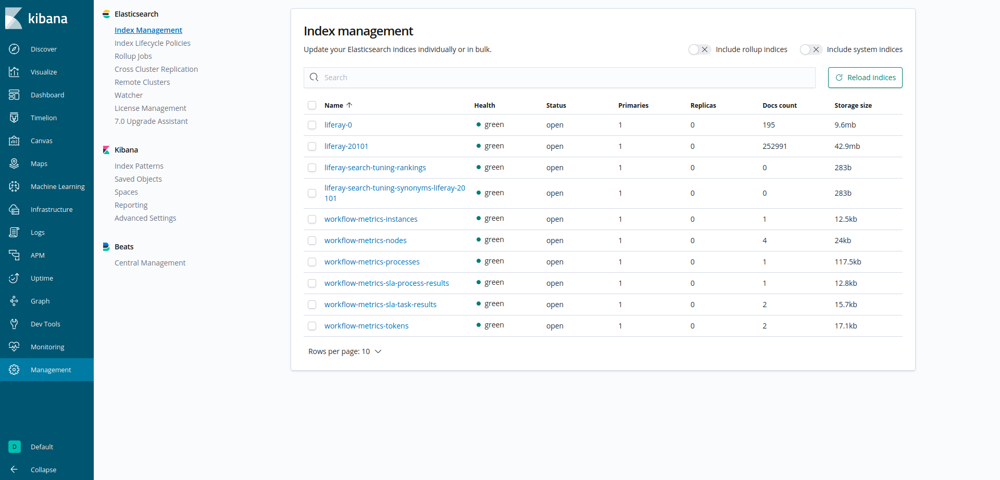
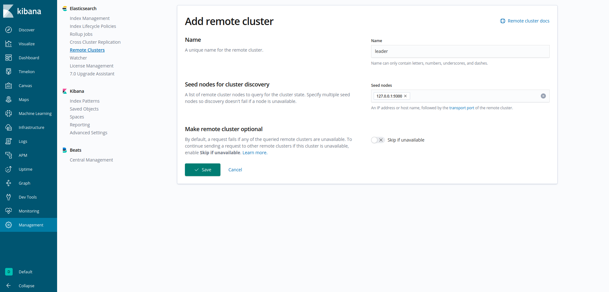
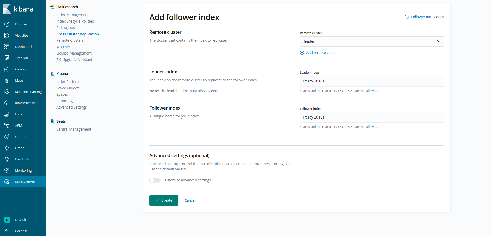
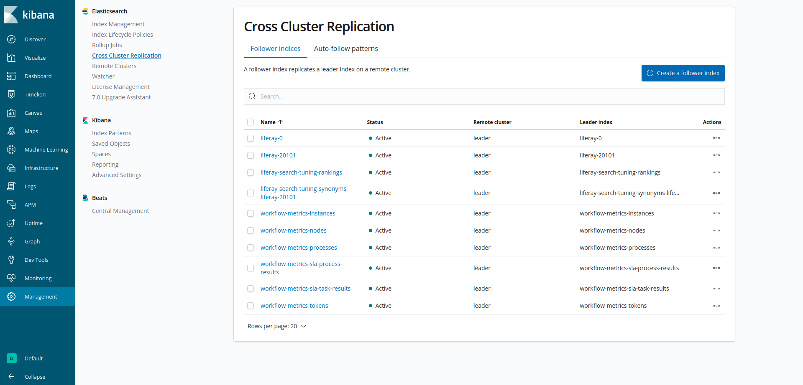
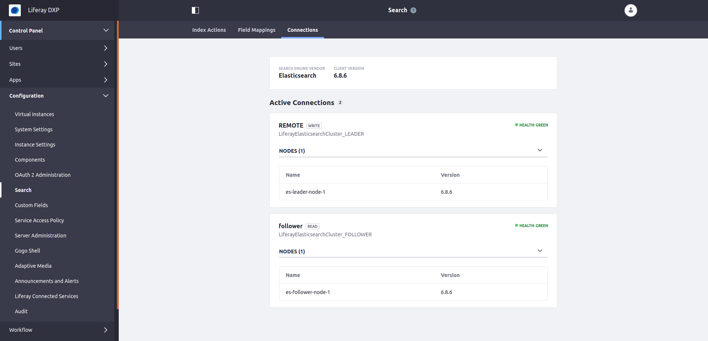

# Configuring Cross-Cluster Replication

> **Liferay Enterprise Search (LES) Subscribers**

<!-- SAME DIAGRAM USED IN INTRO ARTICLE

ALSO, ADD A BEFORE AND AFTER LOOK AT THE CONNECTIONS TAB
-->
The commands that involve calling Elasticsearch APIs are provided in a format that allows you to  copy and paste them directly into Kibana's Dev Tools console which can be also accessed through the [X-Pack Monitoring widget](./monitoring-elasticsearch.md).

```Note::
   If you decide to use Kibana, remember that you will have two different Elasticsearch clusters with 1-1 node running in your environment. The `elasticsearch.hosts: [ "http://localhost:<port>" ]` setting in your Kibana's `kibana.yml` must point to the correct port when managing the indexes and other configurations described below to avoid mixing the leader and the follower clusters. In this article, we assume that your leader Elasticserach cluster node is configured to use `9200` while the follower node is using `9201` as HTTP port.
```

<!-- From Tibor: Highlight that the guide is super-simplified and deals with setting up a 1-1 node ES clusters (leader and follower) running on localhost. A prod-ready environment needs different settings.-->
<!-- From Russ: We should just adapt to those settings instead of saying "this guide shows steps that you can't follow for a real setup." I think we need to elevate our docs game for CCR. -->

## Prerequisite: Required DXP Patch Level

To use CCR, all of your DXP cluster nodes must be running on **DXP 7.2 Fix Pack 5+ / Service Pack 2+**.

## Prerequisite for Elasticsearch 6: Enable Soft Deletes

[Soft deletes](https://www.elastic.co/guide/en/elasticsearch/reference/6.7/ccr-requirements.html) must be enabled for all existing indexes. This is not done by default on Elasticsearch 6. Before proceeding, read [here](./configuring-ccr-enabling-soft-deletes-on-elasticsearch-6.md) to configure soft deletes on your Elasticsearch 6 indexes, then resume reading here to set up CCR.

## Prerequisite for Elasticsearch 7: Install the Liferay Connector to Elasticsearch 7

If you are using Elasticsearch 7, you have to install the [Elasticsearch 7 connector](https://web.liferay.com/marketplace/-/mp/application/170390307) from Marketplace **version `3.0.1+`** (requires DXP 7.2 FP5+/SP2+) on all DXP cluster nodes. Read [this article](https://help.liferay.com/hc/en-us/articles/360035444872-Upgrading-to-Elasticsearch-7) on how to upgrade to Elasticsearch 7.

## Install the Cross-Cluster Replication Module

1. Download the Liferay DXP Cross-Cluster Replication for Elasticsearch LPKG from the [LES downloads page](https://customer.liferay.com/downloads).

2. [Install the LPKG](../../system-administration/installing-and-managing-apps/installing-apps/installing-apps.md) into the local Liferay DXP instance.

## Configure the Elasticsearch Clusters

This example uses two single-node Elasticsearch clusters on `localhost`, each with a copy of the same indexes.

A vanilla Liferay DXP 7.2 installation contains the indexes presented in the [Cross Cluster Replication](./cross-cluster-replication.md#liferay-dxp-decide-whichindexes-to-replicate-from-the-remote-cluster) article.

All the Elasticsearch clusters being used by Liferay DXP (2 clusters in this example) need these indexes.

### Configure the Remote Leader Elasticsearch Cluster

In our example setup, the first Elasticsearch cluster is a REMOTE mode cluster with no special configuration required: it accepts reads and writes from it's local Liferay DXP node, and write requests from the Liferay DXP nodes that are in a separate data center.

Configure its `elasticsearch.yml` by specifying a sensible cluster name:

`ES_HOME/config/elasticsearch.yml`

```yaml
cluster.name: LiferayElasticsearchCluster_LEADER
http.port: 9200
node.name: es-leader-node-1
transport.port: 9300
```

Start the server. If you're in the root of the server directory, execute

```bash
./bin/elasticssearch
```

If you're just trying this out and don't yet have the proper license, start an [Elasticsearch trial license](https://www.elastic.co/guide/en/elasticsearch/reference/7.x/start-trial.html):

```json
POST /_license/start_trial?acknowledge=true
```

> On Elasticsearch 6, use
> 
> `POST _xpack/license/start_trial?acknowledge=true`

You'll see a `- valid` message in your log when it installs successfully: 

```bash
[2020-02-26T10:19:36,420][INFO ][o.e.l.LicenseService     ] [user-pc] license [lf263a315-8da3-41f7-8622-lfd7cc14cae29] mode [trial] - valid
```

### Configure the Local Follower Elasticsearch Cluster 

The second Elasticsearch cluster is going to contain the follower (read-only) indexes in the second data center, and will be local to a Liferay DXP node.

Configure its `elasticsearch.yml`, specifying a `http.port` and `transport.port` that won't collide with the other Elasticsearch server:

`ES/HOME/config/elasticsearch.yml`

```yaml
cluster.name: LiferayElasticsearchCluster_FOLLOWER
http.port: 9201
node.name: es-follower-node-1
transport.port: 9301
```

Start the server. If you're in the root of the server directory, execute

```bash
./bin/elasticssearch
```

If you're just trying this out and don't yet have the proper license, start an Elasticsearch trial:

```json
POST /_license/start_trial?acknowledge=true
```

> On Elasticsearch 6, use
> 
> `POST _xpack/license/start_trial?acknowledge=true`

## Configure the Remote Liferay DXP Cluster Node

Admin prepares remote Liferay Instance, that talks with the REMOTE mode Elasticsearch server.

Provide a `portal-ext.properties` file with these contents:

```properties
cluster.link.enabled=true
```

Then configure the Liferay Connector to Elasticsearch X [6 or 7], by providing a configuration file in the `Liferay Home/osgi/configs` folder. If using Elasticsearch 7, name it

```bash
com.liferay.portal.search.elasticsearch7.configuration.ElasticsearchConfiguration.config
```

If using Elasticsearch 6, the configuration file is named

```bash
com.liferay.portal.search.elasticsearch6.configuration.ElasticsearchConfiguration.config
```

Give it these contents:

```properties
clusterName="LiferayElasticsearchCluster_LEADER"
operationMode="REMOTE"
transportAddresses=["localhost:9300"]
additionalIndexConfigurations="index.soft_deletes.enabled: true"
```

Remember that "soft deletes" are enabled by default in Elasticsearch 7, however, you must enable it in Elasticsearch 6 as it is described [here](./configuring-ccr-enabling-soft-deletes-on-elasticsearch-6.md).

```tip::
   During development and testing, it's useful to set ``logExceptionsOnly="false"`` in the configuration file as well.
```

Start the Liferay DXP server.

```note::
   If this is a new DXP installation, don't forget to reindex the spell check indexes through the Search admin in the Control Panel.
```

If you are using Kibana and it is configured to connect to your remote/leader Elasticsearch cluster, navigate to Management - Index Management to see the available Liferay indexes. You will see a similar overview:



Now is the time to restart Kibana after updating `kibana.yml` to connect to your local/follower Elasticsearch cluster:

```yaml
elasticsearch.hosts: [ "http://localhost:9201" ]
```

## Replicate the Leader Indexes into the Local Follower Elasticsearch Cluster

Here you'll use two Elasticsearch API endpoints, `_cluster/settings` and `_ccr/follow`, from the local follower cluster.

You can use [Kibana](./monitoring-elasticsearch.md) to call Elasticsearch's APIs. 

First, from the local Follower Elasticsearch cluster that will contain the follower indexes, set the leader cluster:

```json
PUT /_cluster/settings
{
  "persistent" : {
    "cluster" : {
      "remote" : {
        "leader" : {
          "seeds" : [
            "127.0.0.1:9300" 
          ]
        }
      }
    }
  }
}
```

Alternatively, this can also be done through Kibana - Management - Remote Clusters: click on the "Add a remote cluster" button and fill out the form as it is shown on the image below:



Messages including `updating [cluster.remote.leader.seeds]` will appear in the log:

```bash
[2020-05-21T13:22:00,256][INFO ][o.e.c.s.ClusterSettings  ] [es-follower-node-1] updating [cluster.remote.leader.seeds] from [[]] to [["127.0.0.1:9300"]]
[2020-05-21T13:22:00,259][INFO ][o.e.c.s.ClusterSettings  ] [es-follower-node-1] updating [cluster.remote.leader.seeds] from [[]] to [["127.0.0.1:9300"]]
[2020-05-21T13:22:00,263][INFO ][o.e.c.s.ClusterSettings  ] [es-follower-node-1] updating [cluster.remote.leader.seeds] from [[]] to [["127.0.0.1:9300"]]
[2020-05-21T13:22:00,263][INFO ][o.e.c.s.ClusterSettings  ] [es-follower-node-1] updating [cluster.remote.leader.seeds] from [[]] to [["127.0.0.1:9300"]]
```

Once the leader is configured, use the Follow API to perform the initial index replication of the leader's indexes into the local/follower cluster:

```json
PUT /liferay-20101/_ccr/follow?wait_for_active_shards=1
{
  "remote_cluster" : "leader",
  "leader_index" : "liferay-20101"
}
```

Alternatively, this can also be done through Kibana - Management - Cross Cluster Replication: click on the "Create a follower index" button and fill out the form as it is shown on the image below:



```note::
   The value ``leader`` is used in the API calls above, as it is the default `alias to the remote cluster <https://www.elastic.co/guide/en/elasticsearch/reference/7.x/ccr-getting-started.html#ccr-getting-started-remote-cluster>`_: if you use a different alias, change this value in the API calls, and set the same value in the ``remoteClusterAlias`` property of the ``CrossClusterReplicationConfiguration``.
```

Messages indicating that the shard has started and that the leader is being tracked will appear in the console:

```bash
[2020-05-21T13:31:29,888][INFO ][o.e.c.r.a.AllocationService] [es-follower-node-1] Cluster health status changed from [YELLOW] to [GREEN] (reason: [shards started [[liferay-20101][0]] ...]).
[2020-05-21T13:31:29,902][DEBUG][o.e.a.a.c.s.r.RestoreClusterStateListener] [es-follower-node-1] restore of [_latest_/_latest_] completed
[2020-05-21T13:31:29,940][INFO ][o.e.x.c.a.ShardFollowTasksExecutor] [es-follower-node-1] [liferay-20101][0] Starting to track leader shard [liferay-20101][0]
[2020-05-21T13:31:29,972][INFO ][o.e.x.c.a.ShardFollowNodeTask] [es-follower-node-1] [liferay-20101][0] following leader shard [liferay-20101][0], follower global checkpoint=[-1], mapping version=[11], settings version=[1]
```

Repeat the above PUT call for all the indexes you see listed at Control Panel &rarr; Configuration &rarr; Search &rarr; Field Mappings. For example, these indexes are present in most systems:

- liferay-0
- liferay-20101
- liferay-search-tuning-rankings
- liferay-search-tuning-synonyms-liferay-20101
- workflow-metrics-instances
- workflow-metrics-nodes
- workflow-metrics-processes
- workflow-metrics-sla-instance-results
- workflow-metrics-sla-task-results
- workflow-metrics-tokens

At this point, if you navigate to Management - Cross Cluster Replication in Kibana, you should see something like this:



Now the local/follower Elasticsearch cluster knows how to replicate from the remote/leader Elasticsearch cluster. The last step is to wire up the local Liferay DXP cluster node so it can read from this local/follower Elasticsearch cluster's indexes, and write to the remote/leader Elasticsearch cluster.

### Configure the Local Liferay DXP Cluster Node

Configure Tomcat to use different ports than your remote DXP node. We use `9080` as the HTTP port in this example setup.

Provide a `portal-ext.properties` file with these contents:

```properties
cluster.link.enabled=true
```

Then configure the Liferay Connector to Elasticsearch X [6 or 7], by providing a configuration file in the `Liferay Home/osgi/configs` folder. If using Elasticsearch 7, name it

```bash
com.liferay.portal.search.elasticsearch7.configuration.ElasticsearchConfiguration.config
```

If using Elasticsearch 6, the configuration file is named

```bash
com.liferay.portal.search.elasticsearch6.configuration.ElasticsearchConfiguration.config
```

This file configures the write-enabled connection to the remote Elasticsearch cluster with the leader indexes. Give it these contents:

```properties
clusterName = "LiferayElasticsearchCluster_LEADER"
operationMode = "REMOTE"
transportAddresses = ["localhost:9300"]
```

Now configure the read-only connection to the local Elasticsearch server with the follower indexes. Provide a configuration file named 

```bash
com.liferay.portal.search.elasticsearch.cross.cluster.replication.internal.configuration.ElasticsearchConnectionConfiguration-follower.config
```

Give it these contents:

```properties
connectionId = "follower"
clusterName = "LiferayElasticsearchCluster_FOLLOWER"
transportAddresses = ["localhost:9301"]
```

It's recommended that the suffix (`follower` in this example) at the end of the file name be the same as what is defined as the `connectionId` in the configuration.

And finally, enable CCR by providing a configuration file named

```bash
com.liferay.portal.search.elasticsearch.cross.cluster.replication.internal.configuration.CrossClusterReplicationConfiguration.config
```

with the following content:

```properties
ccrEnabled = B"true"
ccrLocalClusterConnectionConfigurations = ["localhost:9080=follower"]
remoteClusterAlias = "leader"
```

```note::
   Remember that we have configured our local/follower DXP node to use `9080` as HTTP port. If you are going with a different setting, map the portal address in `ccrLocalClusterConnectionConfigurations` accordingly.
```

Now you can start the local Liferay DXP Cluster node.

## Verify the Setup

On the follower DXP cluster node, navigate to Control Panel - Configuration - Search and select the Connections tab. Your connections should look something like this:



```note::
   The Connections tab appears in the Search admin when the CCR module is installed.
```

<!-- From Tibor: Add note that the actual port number may be different depending on in which order you started the Leader and the Follower clusters if both are running on localhost.-->
<!-- From Russ: I can do this, but I'm not convinced this is possible with these instructions. We set the transport port range to 9500-9600 for this ES cluster, and we left the other with the default setting (9300-9400), so will the startup order matter?-->
