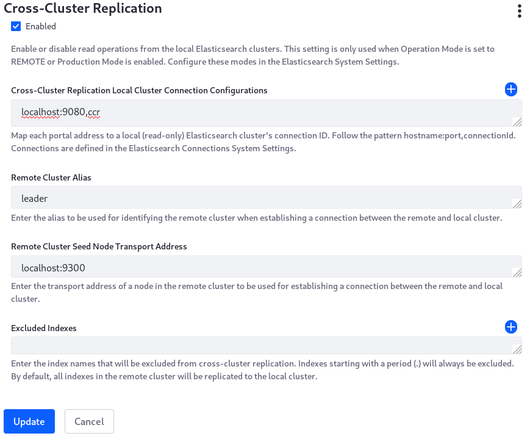

# Configuring CCR: Settings Reference

To help with the CCR configuration process, the example configurations from the step-by-step instructions in this guide are collected here. These configuration are made as generic as possible, but you must adjust paths, ports, etc. to match your environment. In addition, you must perform certain steps manually to complete the installation, so these cannot replace the step-by-step instructions.

The configurations below assume you enable encrypted communications (TLS/SSL) and user authentication through X-Pack Security in your installation. See [Securing Elasticsearch](../../installing-and-upgrading-a-search-engine/elasticsearch/securing-elasticsearch.md) for more information.

```tip::
   `Configuration values provided by .config files <../../../system-administration/configuring-liferay/configuration-files-and-factories/using-configuration-files.md>`__ are propagated throughout a DXP cluster as soon as the file is deployed to a single node. However, it's a best practice to provide identical configurations for each cluster node. 
```

## Remote DXP Cluster Node Configurations

These configuration files are deployed to `[Remote Liferay Home]/osgi/configs`.

### Elasticsearch Configuration

The Remote DXP cluster needs an `ElasticsearchConfiguration.config` file.

File name: `com.liferay.portal.search.elasticsearch7.configuration.ElasticsearchConfiguration.config`

Liferay DXP 7.3 file contents:

```properties
productionModeEnabled="true"
remoteClusterConnectionId="remote"
logExceptionsOnly="false"
```

Liferay DXP 7.2 file contents:

```properties
clusterName="LiferayElasticsearchCluster_LEADER"
operationMode="REMOTE"
transportAddresses=["localhost:9300"]
logExceptionsOnly="false"
```

Liferay DXP 7.2 requires a separate `XPackSecurityConfiguration.config` file.

File name: `com.liferay.portal.search.elasticsearch7.configuration.XPackSecurityConfiguration.config`

Liferay DXP 7.2 file content:


```properties
certificateFormat="PKCS#12"
sslKeystorePath="/PATH/TO/elastic-nodes.p12"
sslKeystorePassword="liferay"
sslTruststorePath="/PATH/TO/elastic-nodes.p12"
sslTruststorePassword="liferay"
requiresAuthentication=B"true"
username="elastic"
password="liferay"
transportSSLVerificationMode="certificate"
transportSSLEnabled=B"true"
```

```tip::
   The X-Pack security configuration file is not required on Liferay DXP 7.3. Security is configured in each connection's ``.config`` file. The values should be identical on all Liferay nodes.
```

### Elasticsearch Connection Configuration

[DXP 7.3 only] Remote connection file name: `com.liferay.portal.search.elasticsearch7.configuration.ElasticsearchConnectionConfiguration-remote.config`

File contents:

```properties
active="true"
connectionId="remote"
networkHostAddresses=["https://localhost:9200"]
username="elastic"
password="liferay"
authenticationEnabled=B"true"
httpSSLEnabled=B"true"
truststorePassword="liferay"
truststorePath="/PATH/to/elastic-nodes.p12"
truststoreType="pkcs12"
```

```tip::
   For Liferay DXP 7.2, you used the ``ElasticsearchConfiguration.config`` and the ``XPackSecurityConfiguration.config`` files to configure the remote connection.
```

[DXP 7.3 only] Read-only connection file name: `com.liferay.portal.search.elasticsearch7.configuration.ElasticsearchConnectionConfiguration-ccr.config`

File contents for Liferay DXP 7.3:

```properties
active="true"
connectionId="ccr"
networkHostAddresses=["https://localhost:9201"]
username="elastic"
password="liferay"
authenticationEnabled=B"true"
httpSSLEnabled=B"true"
truststorePassword="liferay"
truststorePath="/PATH/to/elastic-nodes.p12"
truststoreType="pkcs12"
```

[DXP 7.2 only] Read-only connection file name: `com.liferay.portal.search.elasticsearch.cross.cluster.replication.internal.configuration.ElasticsearchConnectionConfiguration-ccr.config`

File contents for Liferay DXP 7.2:

```properties
clusterName="LiferayElasticsearchCluster_FOLLOWER"
connectionId="ccr"
username="elastic"
password="liferay"
authenticationEnabled=B"true"
transportSSLEnabled=B"true"
networkHostAddress="https://localhost:9201"
transportAddresses=["localhost:9301"]
sslTruststorePassword="liferay"
sslTruststorePath="/PATH/TO/elastic-nodes.p12"
certificateFormat="pkcs12"
sslKeystorePassword="liferay"
sslKeystorePath="/PATH/TO/elastic-nodes.p12"
```
## Local DXP Cluster Node Configurations

These configuration files are deployed to `[Local Liferay Home]/osgi/configs`.

Provide identical Elasticsearch 7 configurations (including the connection configuration files) to the local DXP nodes that you provided to the remote DXP nodes.

### Local DXP Cluster Node CCR Module Configurations

Configure the LES Cross-Cluster Configuration application from the System Settings UI on any node (even one in the remote data center). If the LPKG is deployed, the configuration entry is in System Settings &rarr; Search &rarr; Cross-Cluster Replication.

Set these values:

* The _Read from Local Clusters_ checkbox is checked
* The _Local Cluster Configurations_ property has the value _localhost:9080,ccr_



```important::
   Never set the value to the remote data center here (in the example, it would be ``localhost:8080,remote``). Setting this would cause follower indexes to be created in the remote cluster, where leader indexes of the same name already reside.
```

## Leader Elasticsearch Cluster Node Configurations

Location: `ES_LEADER_HOME/config`

File name: `elasticsearch.yml`

File contents:
```yaml
cluster.name: LiferayElasticsearchCluster_LEADER
node.name: es-leader-node-1

http.port: 9200
transport.port: 9300

xpack.security.enabled: true

### TLS/SSL settings for Transport layer
xpack.security.transport.ssl.enabled: true
xpack.security.transport.ssl.keystore.path: certs/elastic-nodes.p12
xpack.security.transport.ssl.keystore.password: liferay
xpack.security.transport.ssl.truststore.path: certs/elastic-nodes.p12
xpack.security.transport.ssl.truststore.password: liferay
xpack.security.transport.ssl.verification_mode: certificate

## TLS/SSL settings for HTTP layer
xpack.security.http.ssl.enabled: true
xpack.security.http.ssl.keystore.path: certs/elastic-nodes.p12
xpack.security.http.ssl.keystore.password: liferay
xpack.security.http.ssl.truststore.path: certs/elastic-nodes.p12
xpack.security.http.ssl.truststore.password: liferay

# For Kibana
xpack.monitoring.collection.enabled: true
```

## Follower Elasticsearch Cluster Node Configurations

Location: `ES_FOLLOWER_HOME/config`

File name: `elasticsearch.yml`

File contents:

```yaml
cluster.name: LiferayElasticsearchCluster_FOLLOWER
node.name: es-follower-node-1

http.port: 9201
transport.port: 9301

xpack.security.enabled: true

### TLS/SSL settings for Transport layer
xpack.security.transport.ssl.enabled: true
xpack.security.transport.ssl.keystore.path: certs/elastic-nodes.p12
xpack.security.transport.ssl.keystore.password: liferay
xpack.security.transport.ssl.truststore.path: certs/elastic-nodes.p12
xpack.security.transport.ssl.truststore.password: liferay
xpack.security.transport.ssl.verification_mode: certificate

## TLS/SSL settings for HTTP layer
xpack.security.http.ssl.enabled: true
xpack.security.http.ssl.keystore.path: certs/elastic-nodes.p12
xpack.security.http.ssl.keystore.password: liferay
xpack.security.http.ssl.truststore.path: certs/elastic-nodes.p12
xpack.security.http.ssl.truststore.password: liferay

# For Kibana
xpack.monitoring.collection.enabled: true
```
