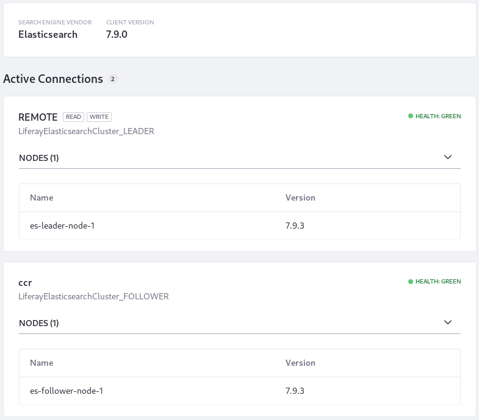
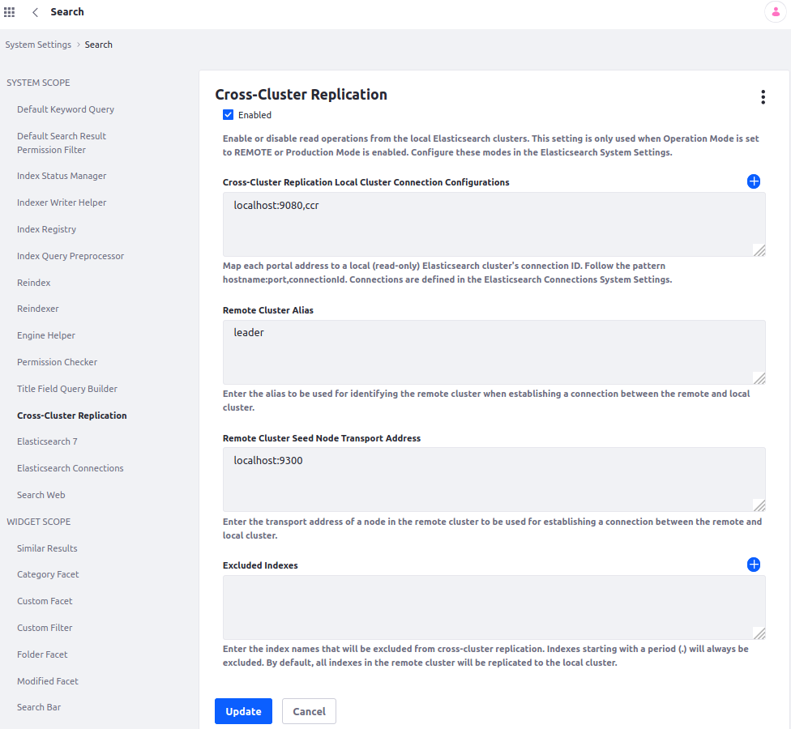

# Configuring CCR in a Local Follower Data Center

> First [configure CCR in the remote/leader data center](./configuring-ccr-in-a-remote-leader-data-center.md) before following the steps below.

The local/follower data center holds Liferay DXP cluster nodes with a read-only connection to the co-located Elasticsearch cluster and a write-only connection to the remote/leader data center's Elasticsearch cluster.

The example configurations are also provided in full in the [CCR configuration reference guide](./ccr-basic-use-case-config-reference.md).

### Configure the Follower Elasticsearch Cluster 

The local Elasticsearch cluster must hold follower (replicated; read-only) indexes and acts as the local search engine co-located Liferay DXP nodes can read from.

```important::
   **Securing a CCR Installation:** As `stated earlier <./configuring-an-example-ccr-installation-replicating-between-data-centers.md#prerequisite-for-security-configure-x-pack-security>`__ the Elasticsearch clusters should use node certificates signed by the same CA and the security settings of each cluster should match. For other approaches and details, `see Elastic's documentation <https://www.elastic.co/guide/en/elasticsearch/reference/7.x/cross-cluster-configuring.html>`__.
```

1. Configure its `elasticsearch.yml`:

   `[Follower Elasticsearch Home]/config/elasticsearch.yml`

   ```yaml
   cluster.name: LiferayElasticsearchCluster_FOLLOWER
   node.name: es-follower-node-1

   http.port: 9201
   transport.port: 9301

   xpack.security.enabled: true

   ### TLS/SSL settings for Transport layer
   xpack.security.transport.ssl.enabled: true
   xpack.security.transport.ssl.keystore.path: certs/elastic-nodes.p12
   xpack.security.transport.ssl.keystore.password: liferay
   xpack.security.transport.ssl.truststore.path: certs/elastic-nodes.p12
   xpack.security.transport.ssl.truststore.password: liferay
   xpack.security.transport.ssl.verification_mode: certificate

   ## TLS/SSL settings for HTTP layer
   xpack.security.http.ssl.enabled: true
   xpack.security.http.ssl.keystore.path: certs/elastic-nodes.p12
   xpack.security.http.ssl.keystore.password: liferay
   xpack.security.http.ssl.truststore.path: certs/elastic-nodes.p12
   xpack.security.http.ssl.truststore.password: liferay

   # For Kibana
   xpack.monitoring.collection.enabled: true
   ```

   To use the security settings (`xpack.security...`) you must set up passwords and obtain node certificates.

1. Start the server. If you're in the root of the server directory, execute

   ```bash
   ./bin/elasticssearch
   ```

1. If you're just trying this out and don't yet have the proper license, start an Elasticsearch trial:

   ```
   POST /_license/start_trial?acknowledge=true
   ```

## Configure the Local Liferay DXP Cluster Node

```tip::
   If testing locally, configure Tomcat to use different ports than your remote DXP node. Use `9080` as the HTTP port, `9443` as the redirect port, and `9005` as the shutdown port to follow this example setup (change the server ports in `[Liferay Home]/tomcat-[version]/conf/server.xml`).
```

1. Copy the [Elasticsearch connection configuration files](./configuring-ccr-in-a-local-follower-data-center.md#configure-the-remote-liferay-dxp-cluster-node) from the remote DXP cluster node's `osgi/configs` folder, into the corresponding folder on the local DXP cluster node. 

   For Liferay DXP 7.3, this includes `*ElasticsearchConnectionConfiguration-remote.config` and `*ElasticsearchConfiguration.config`.

   ```important::
      The ``remoteClusterConnectionId`` value in the ``ElasticsearchConfiguration.config`` must match the ``connectionId`` in the ``ElasticsearchConnectionConfiguration-remote.config`` file. 
   ```

   For Liferay DXP 7.2, this includes `*ElasticsearchConfiguration.config` and `*XPackSecurityConfiguration.config`.

   Once these files are provided, the write connection for the local DXP cluster node is configured.

1. Now configure the read-only connection to the local Elasticsearch server with the follower indexes. 

   For Liferay DXP 7.3, provide a configuration file to `Liferay Home/osgi/configs` named `com.liferay.portal.search.elasticsearch7.configuration.ElasticsearchConnectionConfiguration-ccr.config`. 

   Give it these contents:

   ```properties
   active=B"true"
   connectionId="ccr"
   username="elastic"
   password="liferay"
   authenticationEnabled=B"true"
   httpSSLEnabled=B"true"
   networkHostAddresses=["https://localhost:9201"]
   truststorePassword="liferay"
   truststorePath="/PATH/TO/elastic-nodes.p12"
   truststoreType="pkcs12"
   ```

   For Liferay DXP 7.2, provide a configuration file to `Liferay Home/osgi/configs` named `com.liferay.portal.search.elasticsearch.cross.cluster.replication.internal.configuration.ElasticsearchConnectionConfiguration-ccr.config`.

   ```properties
   clusterName="LiferayElasticsearchCluster_FOLLOWER"
   connectionId="ccr"
   username="elastic"
   password="liferay"
   authenticationEnabled=B"true"
   transportSSLEnabled=B"true"
   networkHostAddress="https://localhost:9201"
   transportAddresses=["localhost:9301"]
   sslTruststorePassword="liferay"
   sslTruststorePath="/PATH/TO/elastic-nodes.p12"
   certificateFormat="pkcs12"
   sslKeystorePassword="liferay"
   sslKeystorePath="/PATH/TO/elastic-nodes.p12"
   ```

   You can use any suffix (`-ccr` in this example) for the [configuration file name](../../../system-administration/configuring-liferay/configuration-files-and-factories/using-factory-configuration.md), but for consistency you should make it identical to the `connectionId` property in the configuration.

1. Start the Liferay DXP cluster node.

Now the connection is configured. 



All that's left is to enable and configure CCR itself.

## Configure the Cross-Cluster Replication Module

The LES Cross-Cluster Replication module triggers the following of the leader cluster and the initial replication of all indexes from the leader cluster to the follower cluster. Triggering follow and replication relies on enabling the CCR functionality in the System Settings UI, and not via configuration file (`.config`). Configure CCR from any Liferay DXP node in either data center:

1. Open the Global Menu and navigate to _Control Panel_ &rarr; _System Settings_. Open the _Search_ category. 

1. Open _Cross-Cluster Replication_.

1. Check the box for _Read from Local Clusters_.

1. Set one value in _Local Cluster Configurations_ `localhost:9080,ccr`.

   ```important::
      Never set the value to the remote data center here (in the example, it would be ``localhost:8080,remote``). Setting this would cause follower indexes to be created in the remote cluster, where leader indexes of the same name already reside.
   ```

   This defines the connections that should be read-only. In human language, each entry here is saying "the Liferay server at this address (``localhost:9080``) reads from the Elasticsearch connection with this name (``ccr`` in this example)." 

1. Click _Update_.

In a production setup, you may want to set a different transport address for the remote Elasticsearch cluster (this example used the default) and/or exclude some indexes from being replicated to the follower Elasticsearch cluster. There are configuration fields for those purposes:

**Remote Cluster Seed Node Transport Address**: The transport address of a node in the remote cluster to be used for establishing a connection between the remote and local cluster. Defaults to `localhost:9300`.

**Excluded Indexes**: Enter the index names to be excluded from cross-cluster replication. Indexes starting with a period (.) are always excluded. By default, all indexes in the remote cluster are replicated to the local cluster. This setting is ignored if Automatic Replication is not enabled.

**Automatic Replication Enabled**: Enable or disable automatic creation of follower indexes in the local Elasticsearch clusters when Read from Local Clusters is enabled. Disable this setting if replication is managed manually through Elasticsearch. Defaults to _enabled_.



Log messages appear, indicating successful index replication and that the read connection is enabled

```bash
2021-01-22 02:15:11.112 INFO  [liferay/configuration-1][CrossClusterReplicationConfigurationModelListener:163] Creating follower indexes
2021-01-22 02:15:12.864 INFO  [liferay/configuration-1][CrossClusterReplicationConfigurationModelListener:70] Read operations from local clusters are enabled
```

Once the connections are configured and the indexes replicated, verify the system is working properly.

## Verify the Setup

On the follower DXP cluster node, navigate to Control Panel &rarr; Configuration &rarr; Search. On Liferay DXP 7.2, you must also click the _Connections_ tab. Your connections look like this:


Now CCR is configured. If you run into trouble with your configuration, check out the [troubleshooting guide](./troubleshooting-cross-cluster-replication.md).
