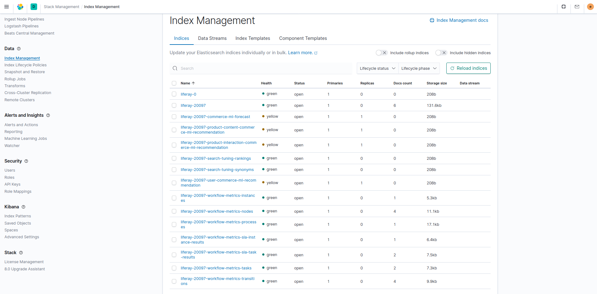

# Configuring CCR In a Remote Leader Data Center

> Ensure you have completed any necessary [prerequisite steps](./configuring-an-example-ccr-installation-replicating-between-data-centers.md) before following the steps below.

This data center holds Liferay DXP cluster nodes with a read-write connection to a co-located Elasticsearch cluster.

The example configured here consists of a single Liferay DXP node and a single Elasticsearch node. The example configurations can also be found in the [CCR configuration reference](./ccr-basic-use-case-config-reference.md), including the security configuration settings.

### Configure the Remote Leader Elasticsearch Cluster

In the example setup, the first Elasticsearch cluster to configure is a production-mode cluster with no CCR-specific configuration: it accepts reads and writes from it's local Liferay DXP node, and write requests from the Liferay DXP nodes that are in a separate data center.

Configure its `elasticsearch.yml`:

`[Remote Elasticsearch Home]/config/elasticsearch.yml`

```yaml
cluster.name: LiferayElasticsearchCluster_LEADER
node.name: es-leader-node-1

http.port: 9200
transport.port: 9300

xpack.security.enabled: true

### TLS/SSL settings for Transport layer
xpack.security.transport.ssl.enabled: true
xpack.security.transport.ssl.keystore.path: certs/elastic-nodes.p12
xpack.security.transport.ssl.keystore.password: liferay
xpack.security.transport.ssl.truststore.path: certs/elastic-nodes.p12
xpack.security.transport.ssl.truststore.password: liferay
xpack.security.transport.ssl.verification_mode: certificate

## TLS/SSL settings for HTTP layer
xpack.security.http.ssl.enabled: true
xpack.security.http.ssl.keystore.path: certs/elastic-nodes.p12
xpack.security.http.ssl.keystore.password: liferay
xpack.security.http.ssl.truststore.path: certs/elastic-nodes.p12
xpack.security.http.ssl.truststore.password: liferay
xpack.security.http.ssl.verification_mode: certificate

# For Kibana
xpack.monitoring.collection.enabled: true
```

To use the security settings (`xpack.security...`) you'll need to set up passwords and obtain node certificates.

Start the server. If you're in the root of the server directory, execute

```bash
./bin/elasticssearch
```

If you're just trying this out and don't yet have the proper license, start an [Elasticsearch trial license](https://www.elastic.co/guide/en/elasticsearch/reference/7.x/start-trial.html):

```json
POST /_license/start_trial?acknowledge=true
```

You'll see a `- valid` message in your log when it installs successfully: 

```bash
[2020-02-26T10:19:36,420][INFO ][o.e.l.LicenseService     ] [es-leader-node-1] license [lf263a315-8da3-41f7-8622-lfd7cc14cae29] mode [trial] - valid
```
### Configure the Remote Liferay DXP Cluster Node

One of the Liferay DXP nodes in this setup reads and writes to/from the leader/remote Elasticsearch server.

Configure the Liferay Connector to Elasticsearch 7 by providing a configuration file in the `Liferay Home/osgi/configs` folder. Name it

```bash
com.liferay.portal.search.elasticsearch7.configuration.ElasticsearchConfiguration.config
```

Give it these contents:

```properties
productionModeEnabled="true"
remoteClusterConnectionId="remote"
logExceptionsOnly="false"
```

```tip::
   During development and testing, it's useful to set ``logExceptionsOnly="false"`` in the configuration files as well.
```

Now configure the remote connection. Provide a configuration file in the `Liferay Home/osgi/configs` folder. Name it 

```bash
com.liferay.portal.search.elasticsearch7.configuration.ElasticsearchConnectionConfiguration-remote.config
```

Give it these contents:

```properties
active=B"true"
connectionId="remote"
username="elastic"
password="liferay"
authenticationEnabled=B"true"
httpSSLEnabled=B"true"
networkHostAddresses=["https://localhost:9200"]
truststorePassword="liferay"
truststorePath="/PATH/TO/elastic-nodes.p12"
truststoreType="pkcs12"
```

The `connectionId` and the`remoteClusterConnectionId` you set in the other config file above must match!

Copy these two `.config` files to each of your follower DXP nodes to configure the same remote (write) connection. You'll configure the read-only follower connection in [Configuring CCR in a Local/Follower Data Center](./configuring-ccr-in-a-local-follower-data-center.md) in the local/follower DXP node in a similar fashion.

Start the Liferay DXP server.

```important::
   If you're configuring a new DXP installation, make sure to reindex the spell check indexes at Control Panel > Configuration > Search, in the *Index Actions* tab.
```

If Kibana is connected to your remote/leader Elasticsearch cluster, navigate to Management &rarr; Index Management to see the available Liferay indexes:



Once the data center containing the remote/leader Elasticsearch servers up and running, you're ready to set up the [local/follower data center](./configuring-ccr-in-a-local-follower-data-center.md).
