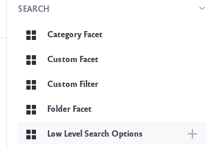
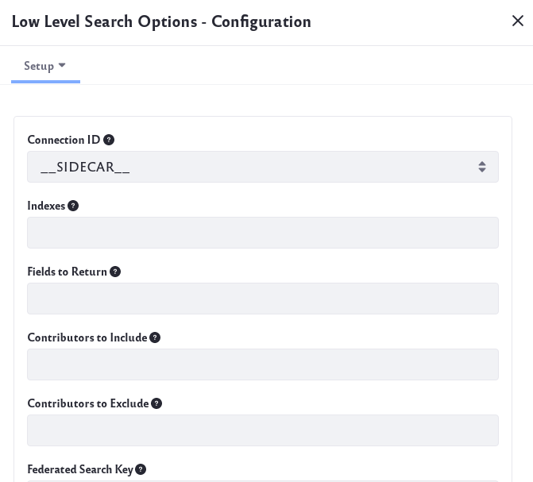
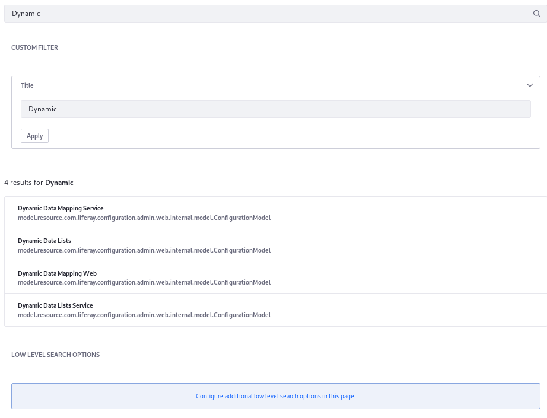

# Understanding Low Level Search Options

Low level search is a search that doesn’t go through the Search and Indexing Framework, which is infrastructure used for searching documents in the Liferay Index.

A common use case for a low level search is to query an index other than the Liferay DXP index. By default, [Search Pages](../working-with-search-pages/search-pages.md) search the Liferay DXP index, but you can also search another index, as long as it’s in the same Elasticsearch cluster (this feature does not work with Solr).

Add the Low Level Search Options widget to a search page and configure it to direct the search to the alternate index. To search multiple indexes from the same page, you can add multiple Low Level Search Options widgets and configure each one with its own Index Name and Federated Search Key.

Searching alternate indexes is a low level operation that bypasses the Liferay DXP permission checking mechanisms, presenting whatever results the search engine returns. For this reason, only administrators can add and configure the Low Level Search Options widget.

To use the Low Level Search Options widget, add it to a Search Page:

1. Click the Add icon () on the page to open the Add Widgets menu.

   

1. Drag the Low Level Search Options widget (from the Search section), and drop it on the page.

1. Click on the Options icon () and click *Configuration*.

   

   The widget has different options to configure,

   **Connection ID:** Select the Connection ID of the connection that will be used to perform the search.

   **Indexes:** Enter the comma-separated names of the alternative indexes to search. Do not enter the standard Liferay index name.

   **Fields to Return:** Enter the names of the stored fields to be returned from the search engine in a comma-separated list. Leave it blank to return all stored fields.

   **Contributors to Include:** Enter the ids of registered search contributors to be included in this search in a comma-separated list of each `SearchRequestContributor`’s Fully Qualified Class Name (e.g., `com.liferay.docs.request.contributor.MySearchRequestContributor`). If not set, all registered search contributors are applied.

   **Contributors to Exclude:** Enter the ids of registered search contributors to be excluded from this search, in a comma-separated list. If not set, all registered search contributors are applied.

   ```Note
   These *Contributors* are components implementing the `com.liferay.portal.search.spi.searcher.SearchRequestContributor` interface (provided by the `com.liferay.portal.search.spi` artifact), which is an extension point (SPI) that intercepts search requests and adds query parts.
   ```

   **Federated Search Key:** Enter the key of an alternate search this widget is participating in. If not set, this widget participates in the default search. This value is usually the name of an application-defined index.

## Example: Searching an Alternate Index

1. Whether testing on the default search page or creating a new [Search Page](../working-with-search-pages/search-pages.md), include the following widgets (removing extra widgets simplifies the exercise, but is not required for it to work):

    * Low Level Search Options
    * Custom Filter
    * Search Bar
    * Search Results

1. Configure all the widgets to participate in an alternate search, by clicking on the Options icon () and clicking *Configuration*. For each, enter *liferay-0* in the Federated Search Key setting.

   All the search widgets expected to react appropriately to the alternate search must be configured with the Federated Search Key. The following steps detail additional configuration.
    
1. Make an additional configuration in the Low Level Search Options widget, adding the index name of the alternate index:

   Enter at least one index name in the *Indexes* setting. To follow this example, use *liferay-0*.

1. Configure the Custom Filter to use the search bar’s default query parameter (*q*) and add a query to the search:

   Enter title under field name to add the title field to the query.

   Choose a Filter Query Type (e.g., Match) for the field.

   Since you’re overriding the default query to search an alternate index, there’s nothing in the query by default. Add any query clauses using the Custom Filter widget(s).

If you’re using *liferay-0* in your Federated Search Key and Indexes settings, search for *dynamic* in the search bar. You’ll see results like this:



## Displaying Low Level Search Results

Assets indexed into the Liferay Company Index (e.g, `liferay-20097`) can implement a `ModelSummaryContributor` to provide their own display logic that's used by the Search Results widget. Low level searches use different display logic since there's no summary to draw from:

* If only one field is configured, it's displayed as the title field (large, bold text is presented).
* If two fields are present, the first is used as the title (large, bold text) and the second is the description field.
* If more than two fields are present, the first is used as the title field (with large, bold text), and the rest are mashed up as a description field.


## Low Level Search and Permission Checking

Permissions checking is not available via low level search. If you search even the Company Index using low level search, important [permission checking](../search-results/search-results-behavior.md#permissions-and-search-results) is circumvented. You almost always want the benefits of permission checking, but one possible use case for intentionally bypassing the permission checks is an admin-only search page where any users accessing the search page must have access to all results in the Company Index.

## Low Level Search and Relevance

Relevance scoring only makes sense within an index. Results coming from separate indexes cannot be accurately scored relative to each other. Therefore, it's best to display the results from each index in a separate Search Results widget.

## Use Case: One Search Bar, Two Search Results

Document the use case mentioned in the relevance section--

1. Add a Low Level Search Options widget to the search page.

1. Configure it by entering these settings:

   **Indexes:** `liferay-0`
   **Federated Search Key:** `liferay-0`

1. Add a second Search Results widget to the search page.

1. Configure the second Search Results:

   **Federated Search Key:** `liferay-0`

Now you’re able to configure the out of the box search widgets to participate in searches against any Elasticsearch index in the cluster.
